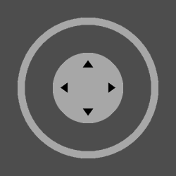
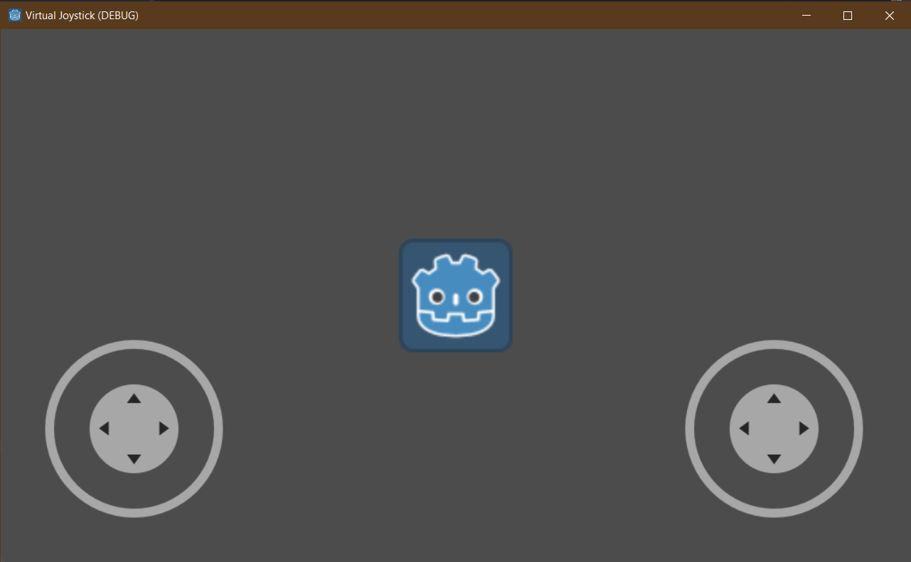
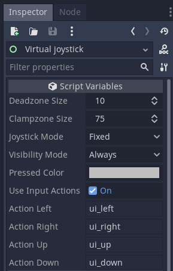
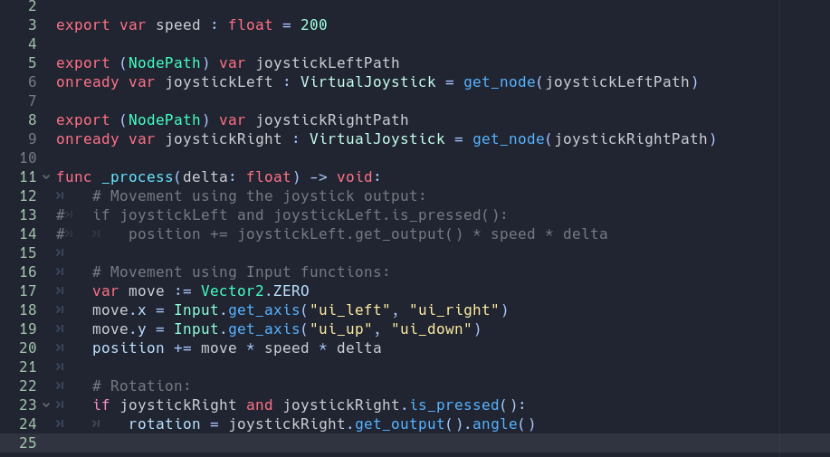

# Godot Virtual Joystick

A simple virtual joystick for touchscreens, with useful options.

GitHub Page: https://github.com/MarcoFazioRandom/Virtual-Joystick-Godot

Godot Engine: https://godotengine.org

### PREVIEWS:

Easy to setup:  

Easy to use:  

### OPTIONS:  

- Joystick mode: 
	- Fixed: The joystick doesn't move. 
	- Dynamic: Every time the joystick area is pressed, the joystick position is set on the touched position. 

- Dead zone size: If the tip is inside this range the output is zero.

- Clamp zone size: The max distance the tip can reach.

- Visibility mode: 
	- Always: Always visible.
	- touchscreen only: Visible on touch screens only (will hide if the device has not a touchscreen).

- Use input actions: if true the joystick will trigger the input actions created in Project -> Project Settings -> Input Map

### HELP:  
- The Control parent of the joystick is the area in which the joystick can move in Dynamic mode.  
- For moving the joystick inside his area, select it, right click, turn on "Editable Children" and then change the position of the Base node.  
- With "Editable Children" turned on you can also edit the joystick textures and colors.  
- **To be able able to use multitouch and mouse, I advise you got to Project -> Project Settings -> General -> Input Devicesto and turn ON "emulate touch from mouse" and turn OFF "emulate mouse from touch".**
- Create a CanvasLayer node and name it "UI", it'll contain all the UI elements, then add the Joystick scene as a child of the UI node and move it where you prefer.  
- An example scene is provided in the "Test" folder.  
